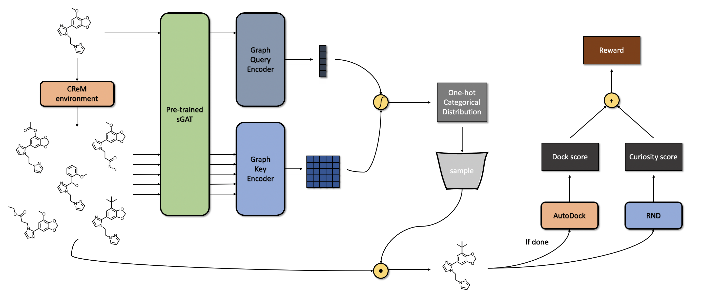

# Distilled Graph Attention Policy Network


This repository is the official implementation of Distilled Graph Attention Policy Network (DGAPN) in the paper [**Spatial Graph Attention and Curiosity-driven Policy for Antiviral Drug Discovery**](http://arxiv.org/abs/2106.02190). The implementation of Spatial Graph Attention Network (sGAT) submodule can be found [here](https://github.com/yulun-rayn/sGAT).


## Requirements

#### 1. Setting up the Repository
```bash
git clone https://github.com/njchoma/DGAPN
cd DGAPN
git submodule update --init --recursive
```

#### 2. Install Python Dependencies
```bash
conda create -n dgapn-env --file requirements.txt
conda activate dgapn-env
pip install crem==0.2.5
```

#### 3. Install Learning Libraries
- [Pytorch](https://pytorch.org/) [**1.8**.0](https://pytorch.org/get-started/previous-versions/)
- [Pytorch Geometric](https://pytorch-geometric.readthedocs.io/en/latest/) [**1.7**.0](https://pytorch-geometric.readthedocs.io/en/1.7.0/notes/installation.html)

  \* *make sure to install the right versions for your toolkit*

#### 4. Install Docking Software (if docking reward is desired)

To evaluate molecular docking scores, the docking program [AutoDock-GPU](https://github.com/ccsb-scripps/AutoDock-GPU/wiki) and [Open Babel](https://open-babel.readthedocs.io/en/latest/Command-line_tools/babel.html) need to be installed. After installations, change `OBABEL_PATH` and `ADT_PATH` in [the reward function](src/reward/adtgpu/get_reward.py) to the corresponding executable paths on your system.

[The provided resources](src/reward/adtgpu/receptor) are for docking in the catalytic site of NSP15. If docking against a new protein is desired, several input receptor files need to be generated, see [the sub-directory](src/reward/adtgpu) for more details.


## Training

Once the conda environment is set up, the function call to train the DGAPN is:

```bash
./main_train.sh &
```

A list of flags may be found in `main_train.sh` and `src/main_train.py` for experimentation with different network and training parameters (`--reward_type dock` only if docking software has been set up). The run log and models are saved under `*artifact_path*/saves`, and the tensorboard log is saved under `*artifact_path*/runs`.

If you wish to produce a pre-trained graph embedding model for DGAPN training, or just want to try out supervised learning with sGAT, check out `src/gnn_embed` for the submodule instructions (installation steps can be skipped if a DGAPN environment is already established).

## Evaluation

After training a model, use `main_evaluate.sh` to produce and evaluate molecules. The flag `--model_path` should be modified to direct to a trained DGAPN model.

```bash
./main_evaluate.sh
```

Molecules will be saved in the artifact directory (set via the `--artifact_path` flag in `main_evaluate.sh`) as a csv file, where each line contains a molecule's SMILES string and associated docking score.

## Pre-trained Models
Trained DGAPN models on docking reward and samples of molecules in evaluation can be found [here](https://github.com/yulun-rayn/SGAnCP4ADD/tree/master/artifact/dgapn).

## License

Contributions are welcome! All content here is licensed under the MIT license.
